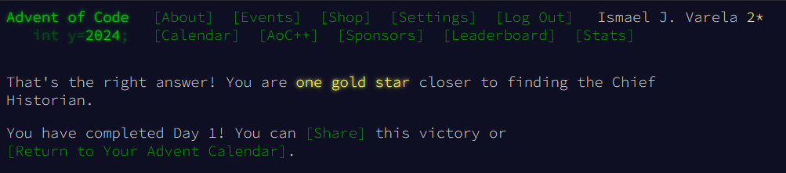
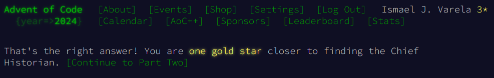

# Advent Of Code 2024

## Day 1

### Reconciliation

For example:
```
3   4
4   3
2   5
1   3
3   9
3   3
```

Maybe the lists are only off by a small amount! To find out, pair up the numbers and measure how far apart they are. Pair up the smallest number in the left list with the smallest number in the right list, then the second-smallest left number with the second-smallest right number, and so on.

Within each pair, figure out how far apart the two numbers are; you'll need to add up all of those distances. For example, if you pair up a 3 from the left list with a 7 from the right list, the distance apart is 4; if you pair up a 9 with a 3, the distance apart is 6.

In the example list above, the pairs and distances would be as follows:

    The smallest number in the left list is 1, and the smallest number in the right list is 3. The distance between them is 2.

    The second-smallest number in the left list is 2, and the second-smallest number in the right list is another 3. The distance between them is 1.

    The third-smallest number in both lists is 3, so the distance between them is 0.

    The next numbers to pair up are 3 and 4, a distance of 1.

    The fifth-smallest numbers in each list are 3 and 5, a distance of 2.

    Finally, the largest number in the left list is 4, while the largest number in the right list is 9; these are a distance 5 apart.

To find the total distance between the left list and the right list, add up the distances between all of the pairs you found. In the example above, this is 2 + 1 + 0 + 1 + 2 + 5, a total distance of 11!

#### Solution


### Part 2

The Historians can't agree on which group made the mistakes or how to read most of the Chief's handwriting, but in the commotion you notice an interesting detail: a lot of location IDs appear in both lists! Maybe the other numbers aren't location IDs at all but rather misinterpreted handwriting.

This time, you'll need to figure out exactly how often each number from the left list appears in the right list. Calculate a total similarity score by adding up each number in the left list after multiplying it by the number of times that number appears in the right list.

Here are the same example lists again:
```
3   4
4   3
2   5
1   3
3   9
3   3
```

For these example lists, here is the process of finding the similarity score:

    The first number in the left list is 3. It appears in the right list three times, so the similarity score increases by 3 * 3 = 9.

    The second number in the left list is 4. It appears in the right list once, so the similarity score increases by 4 * 1 = 4.

    The third number in the left list is 2. It does not appear in the right list, so the similarity score does not increase (2 * 0 = 0).

    The fourth number, 1, also does not appear in the right list.

    The fifth number, 3, appears in the right list three times; the similarity score increases by 9.

    The last number, 3, appears in the right list three times; the similarity score again increases by 9.

So, for these example lists, the similarity score at the end of this process is 31 (9 + 4 + 0 + 0 + 9 + 9).

Once again consider your left and right lists. What is their similarity score?

#### Solution



## Day 2

### Part one

The unusual data (your puzzle input) consists of many reports, one report per line. Each report is a list of numbers called levels that are separated by spaces. For example:
```
7 6 4 2 1
1 2 7 8 9
9 7 6 2 1
1 3 2 4 5
8 6 4 4 1
1 3 6 7 9
```

This example data contains six reports each containing five levels.

The engineers are trying to figure out which reports are safe. The Red-Nosed reactor safety systems can only tolerate levels that are either gradually increasing or gradually decreasing. So, a report only counts as safe if both of the following are true:

* The levels are either all increasing or all decreasing.
* Any two adjacent levels differ by at least one and at most three.

In the example above, the reports can be found safe or unsafe by checking those rules:

    7 6 4 2 1: Safe because the levels are all decreasing by 1 or 2.

    1 2 7 8 9: Unsafe because 2 7 is an increase of 5.

    9 7 6 2 1: Unsafe because 6 2 is a decrease of 4.

    1 3 2 4 5: Unsafe because 1 3 is increasing but 3 2 is decreasing.

    8 6 4 4 1: Unsafe because 4 4 is neither an increase or a decrease.

    1 3 6 7 9: Safe because the levels are all increasing by 1, 2, or 3.

So, in this example, 2 reports are safe.

Analyze the unusual data from the engineers. How many reports are safe?

#### Solution


### Part 2

Now, the same rules apply as before, except if removing a single level from an unsafe report would make it safe, the report instead counts as safe.

More of the above example's reports are now safe:

    7 6 4 2 1: Safe without removing any level.
    1 2 7 8 9: Unsafe regardless of which level is removed.
    9 7 6 2 1: Unsafe regardless of which level is removed.
    1 3 2 4 5: Safe by removing the second level, 3.
    8 6 4 4 1: Safe by removing the third level, 4.
    1 3 6 7 9: Safe without removing any level.

    Create condition where the first number can be removed
    50 43 41 38 37 35 31 27: true
    62 64 66 66 63: false
    82 80 78 76 72 74: true

Thanks to the Problem Dampener, 4 reports are actually safe!

Update your analysis by handling situations where the Problem Dampener can remove a single level from unsafe reports. How many reports are now safe?
